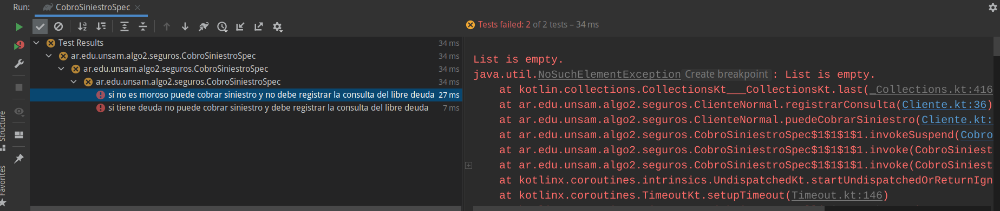
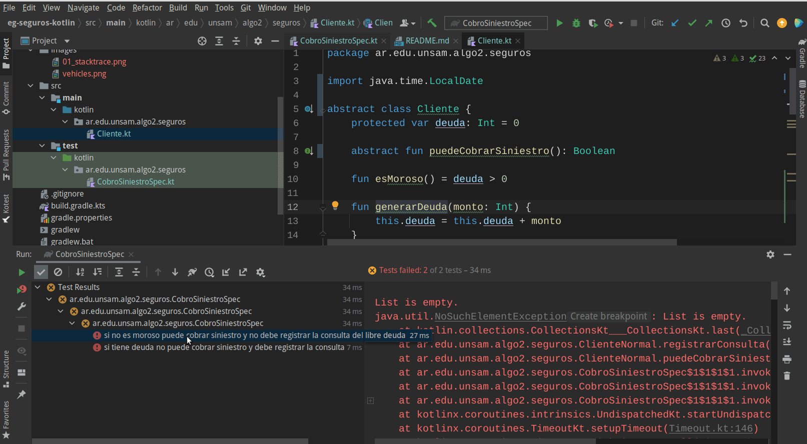
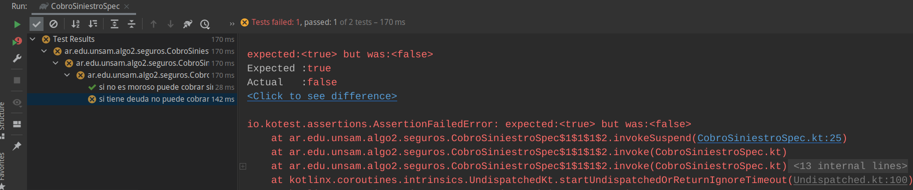
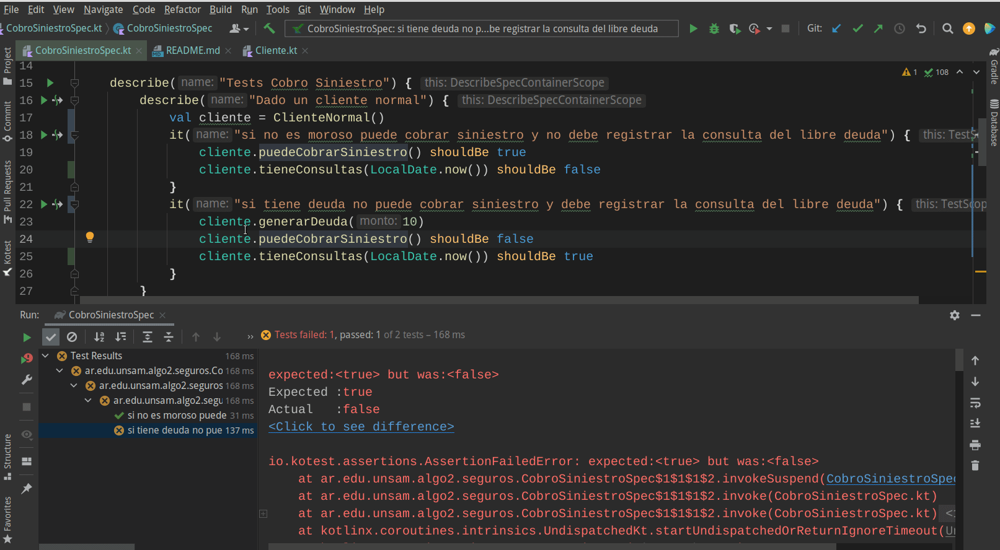
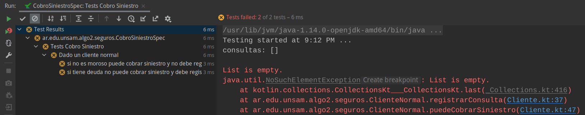
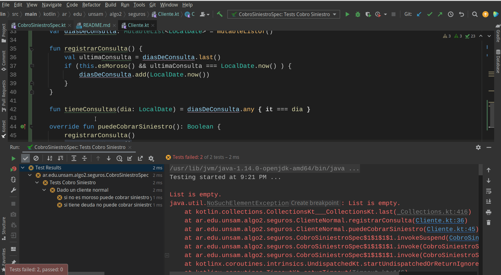
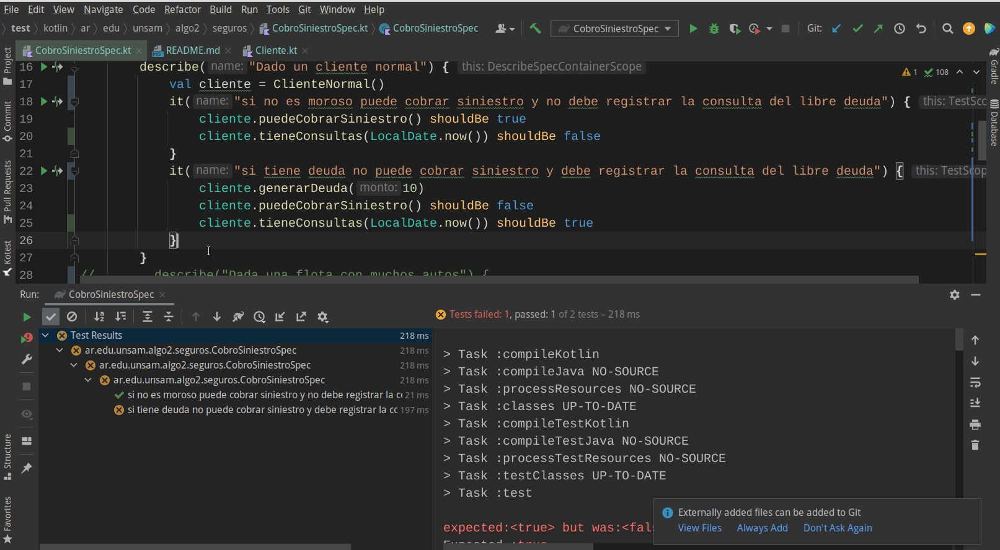
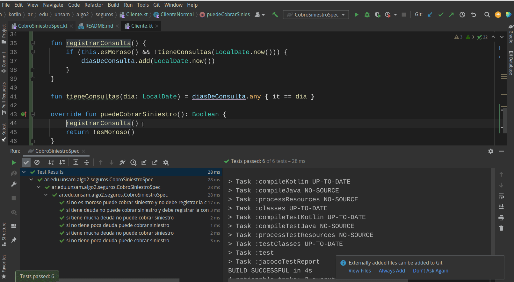

## Ejercicio inicial - introducción a Kotlin: Seguros

[](https://github.com/uqbar-project/eg-seguros-kotlin/actions/workflows/build.yml) [](https://codecov.io/gh/uqbar-project/eg-seguros-kotlin)

Este ejercicio tiene dos propósitos

- contar cómo aconsejamos diseñar los casos de prueba utilizando Kotest como framework de testing, para lo cual te recomendamos [este artículo para seguir la explicación](http://wiki.uqbar.org/wiki/articles/testeo-unitario-avanzado.html)
- entender las diferentes formas de corrección de errores, que se explica a continuación

## Dominio


Un sistema de seguros de automotor define cuándo pagar un siniestro, las condiciones pueden variar:

- para los clientes normales, si no son morosos (la deuda debe ser 0)
- para las flotas de autos, se soporta una deuda de hasta $ 10.000 si el cliente tiene más de 5 vehículos ó hasta $ 5.000 en caso contrario

> Como requerimiento extra, los clientes normales deben registran las fechas en los que se consulta si se puede pagar un siniestro **solamente cuando tienen deuda** (sin duplicarlas, si un cliente con deuda consultó 3 veces el sábado pasado y 5 veces el lunes, debe figurar el sábado y el lunes como días en los que se realizó la consulta).

## Objetivo

Queremos entender diferentes metodologías para corregir errores.

## To TDD or not to TDD

Si resolvemos el ejercicio mediante la técnica del TDD (Test Driven Development), la primera ventaja que tenemos es que los tests no solo guían nuestra metodología de trabajo, sino que permiten detectar los errores lo más tempranamente posible. Más allá de que usemos TDD a rajatabla o utilicemos un esquema mixto donde alternemos código de negocio / tests, **los tests son nuestra mejor herramienta para detectar errores y garantizar que fueron resueltos**.

## Primeros tests, primeros errores

Escribimos nuestra primera clase de test, concentrándonos en el escenario de los clientes normales.

```kotlin
class CobroSiniestroSpec : DescribeSpec({
    isolationMode = IsolationMode.InstancePerTest

    describe("Tests Cobro Siniestro") {
      describe("Dado un cliente normal") {
        it("si no es moroso puede cobrar siniestro y no debe registrar la consulta del libre deuda") {
          // Arrange
          val clienteNoMoroso = ClienteNormal()
          // Assert
          clienteNoMoroso.puedeCobrarSiniestro() shouldBe true
          clienteNoMoroso.tieneConsultas(LocalDate.now()) shouldBe false
        }
        it("si tiene deuda no puede cobrar siniestro y debe registrar la consulta del libre deuda") {
          // Arrange
          val clienteMoroso = ClienteNormal()
          // Act
          clienteMoroso.facturar(10)
          // Assert
          clienteMoroso.puedeCobrarSiniestro() shouldBe false
          clienteMoroso.tieneConsultas(LocalDate.now()) shouldBe true
        }
      } 
    }
})
```

El cliente normal se define de la siguiente manera:

```kotlin
abstract class Cliente {
    protected var deuda = 0

    abstract fun puedeCobrarSiniestro(): Boolean

    fun esMoroso() = deuda > 0

    fun facturar(monto: Int) {
      deuda += monto
    }
}

class ClienteNormal : Cliente() {
  private val diasDeConsulta = mutableListOf<LocalDate>()

  fun registrarConsulta() {
    val ultimaConsulta = diasDeConsulta.last()
    if (esMoroso() && ultimaConsulta === LocalDate.now() ) {
        diasDeConsulta.add(LocalDate.now())
    }
  }

  fun tieneConsultas(dia: LocalDate) = diasDeConsulta.any { it === dia }

  override fun puedeCobrarSiniestro(): Boolean {
    registrarConsulta()
    return !esMoroso()
  }
}
```

Al ejecutar los tests, vemos que ambos están fallando:



Primera noción intuitiva: si fallan todos los tests del cliente normal, puede haber un error general (del setup de los tests o más concretamente en la implementación de los objetos de negocio).

### Stack Trace

El stack trace permite recorrer la jerarquía de envío de mensajes directamente donde ocurrió el problema, nos conviene bucear desde el origen del problema hacia atrás:



Ok, sabemos que el problema ocurre cuando queremos consultar la última vez que se registró la consulta, pero la colección está vacía.

- el mensaje de error `List is empty` nos da una pista, es la colección `diasDeConsulta` entonces la que tiene el problema
- cada click de un elemento en el stack trace nos lleva a la línea de código correspondiente

Resolvemos entonces el problema: hay que considerar cuando no existen consultas para ese día.

```kotlin
fun registrarConsulta() {
    if (this.esMoroso() && !tieneConsultas(LocalDate.now())) {
        diasDeConsulta.add(LocalDate.now())
    }
}
```

Ejecutamos los tests:



Ya estamos mejor, uno de los test pasa satisfactoriamente.

### Debugging

El segundo test se rompe, vamos a utilizar el **Debugger** de IntelliJ que es una herramienta muy útil cuando la aprendemos a manejar. Hay varias cosas para contar

- antes de ejecutar los tests, ponemos un **Breakpoint** haciendo un click apenas a la derecha del número de línea (o presionar `Ctrl` + `F8`)  
- luego nos ubicamos en el test que queremos debuggear, y al hacer click sobre el ícono de play verde, seleccionamos `Debug` sobre ese test
- se inicia el debugger que se detiene en la línea que marcamos como breakpoint.
  - a partir de aquí podemos avanzar línea por línea en profundidad mediante `F7` (Step into), lo que es conveniente cuando queremos explorar lo que ocurre cuando enviamos un mensaje.
  - cuando no nos interesa ver lo que va a ocurrir al enviar un mensaje, podemos utilizar el shortcut `F8` (Step over) que simplemente resuelve el envío del mensaje y vuelve el control a la siguiente línea del método que estamos debuggeando
  - pueden explorar otras opciones, como Step Out (`Shift` + `F8`) que termina de ejecutar el método donde estamos y sale hacia afuera
- en este caso navegamos en profundidad y podemos hacer click sobre el botón `+` sobre las variables para evaluar expresiones dentro de un método, lo que nos es útil para ver el valor que tiene
- y también podemos poner un breakpoint sobre una expresión lambda, **que es la que finalmente nos permite determinar que el problema está en la comparación**



Efectivamente el problema está en que las fechas que estamos comparando son el mismo día (el día de hoy) pero son dos instancias diferentes. Y las comparamos mediante el `===`:

```kotlin
fun tieneConsultas(dia: LocalDate) =  diasDeConsulta.any { it === dia }
```

Si en lugar de eso comparamos igualdad estructural con `==`:

```kotlin
fun tieneConsultas(dia: LocalDate) =  diasDeConsulta.any { it == dia }
```

y ahora sí tenemos los dos tests ok.

### Consecuencias del debugging

Debuggear es una herramienta útil para encontrar y solucionar un error:

- tenemos a mano todo el contexto de ejecución
- podemos inspeccionar las referencias (para pensar: ¿qué pasa con el encapsulamiento?)
- avanzar paso a paso y ver el cambio de estado de los objetos nos ayuda a entender lo que pasa

<br>
por otra parte

- si bien es cómodo, necesitamos invertir tiempo en tener en nuestra mente el estado de los objetos,
- luego de un tiempo, nuestra atención pierde el foco y es fácil olvidar lo que estamos resolviendo
- es preferible estar concentrado a la hora de desarrollar y no confiar en que luego al debuggear lo podremos resolver.

## Búsqueda binaria del error

El [algoritmo de búsqueda binaria](https://en.wikipedia.org/wiki/Binary_search_algorithm) se suele aprender como técnica para adivinar un número, por ejemplo del 1 al 8:

- ¿es mayor a 4? sí (descartamos 1, 2, 3, 4, podrían ser 5, 6, 7, 8)
- ¿es mayor a 6? sí (descartamos 5, 6, podrían ser 7 u 8)
- ¿es mayor a 7? no => entonces es 7 (descartado 8, solo queda 7)

De esa misma manera trabajan los electricistas para encontrar una fuga eléctrica o un cortocircuito: se van detectando puntos intermedios por donde pasa el código hasta encontrar la falla.

En nuestro caso, se puede implementar de varias maneras, pero las más conocidas son dos:

- imprimir por consola
- comentar el código para ver qué efectos provoca

## Segundo escenario

Supongamos que volvemos a nuestro estado inicial de código, donde tenemos el error original:


### Print, print, print

Aprovechando el stack trace del test nos ubicamos en el origen del error e imprimimos por consola las variables relevantes:

```kotlin
fun registrarConsulta() {
    println("consultas: ${diasDeConsulta}")
    val ultimaConsulta = diasDeConsulta.last()
    println("tiene consultas? ${ultimaConsulta}")
    if (this.esMoroso() && ultimaConsulta === LocalDate.now() ) {
        diasDeConsulta.add(LocalDate.now())
    }
}
```

Cuando ejecutamos los tests, vemos que aparece el primer println y el segundo no:



En este caso no parece ser tan útil esta técnica respecto a las anteriores que presentamos, pero aun así permite confirmar que los días de consulta están vacíos. 

Otro de los usos conocidos del print por consola es dejar rastros (como las miguitas de pan del cuento de Hansel y Gretel), del estilo "Paso 1", "Paso 2", "Paso 3 - dentro del if", "Paso 3 - por el else", etc. Cuando no tenemos interfaz de usuario, ni persistencia, ni la necesidad de lograr que dos o más ambientes de objetos se comuniquen (lo que se llama distribución), esta técnica es mucho más tediosa e infructífera que el debugging que ya hemos presentado:

- no podemos detener la ejecución para poder ver todo el contexto, solo lo que mandamos a imprimir
- requiere un trabajo de asociación de leer código de diferentes clases e interpretar el output de la consola al mismo tiempo

No obstante, para materias más avanzadas o bien cuando es necesario hacer un test de integración mucho más complejo de automatizar, imprimir por consola es una técnica que sigue siendo necesaria conforme aumenta la complejidad de las aplicaciones que construimos.

## Comentar código que falla

Volviendo al test que falla, una técnica que puede ayudar es comentar el código que falla. Entonces ¿qué pasa si "cortamos el cable" que nos lleva a registrar la consulta?:



En lugar de error los tests muestran una falla: si comentamos el segundo assert del test y los tests pasan en verde. 



El lector puede preguntarse, ¿qué sentido tiene?

Las dos funcionalidades que resuelve cada cliente normal son:

- indicar si puede cobrar el siniestro nuestro cliente
- registrar la consulta si el cliente es moroso

Lo que pudimos hacer hasta el momento es aislar la primera funcionalidad, y comprobar que está funcionando bien. Para continuar, debemos descomentar entonces el assert y la llamada al método `registrarConsulta`, con la ventaja de saber que la otra funcionalidad cumple con las especificaciones. Ya sabemos a qué porción de código nos tenemos que enfocar.


### Comentar código para ver si fallan los tests

Un ejemplo interesante podría ser comentar la decisión del método `registrarConsulta` y hacer que **siempre se registre cada consulta**, incluso cuando el cliente normal no es moroso. Otra opción es comentar el registro de la consulta, de manera que aun cuando sea moroso, no quede registro:



Ahora nos tira error el test que verifica que un cliente moroso debería registrar deuda. Eso es bueno y prueba que esa funcionalidad está testeada para los clientes morosos. 


## Resumen

Hemos visto en este ejemplo varias técnicas para corregir errores:

- análisis del código a partir del stack trace
- debugging
- imprimir por consola en determinados puntos del código
- comentar código para ver los efectos que produce (e incluso para detectar fallas en los tests)

No hay una técnica sola que sea mejor que otras, de hecho todas se complementan para ayudarnos a corregir las cosas cuando salen mal, que es parte del flujo normal de todas las personas.
